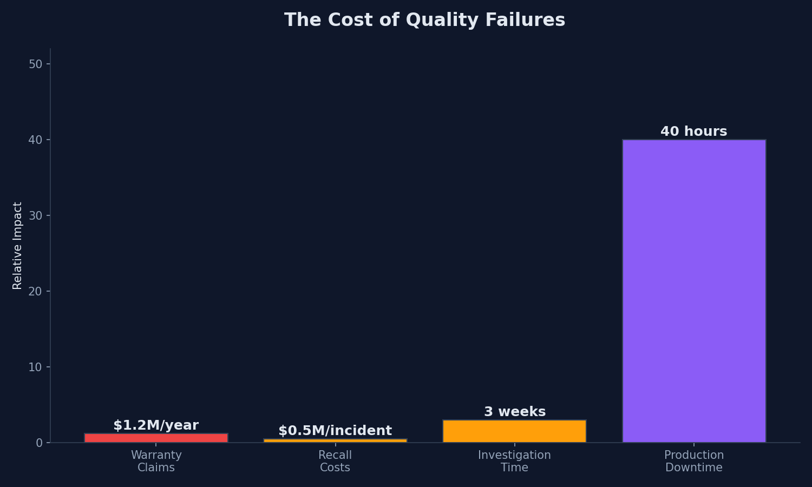
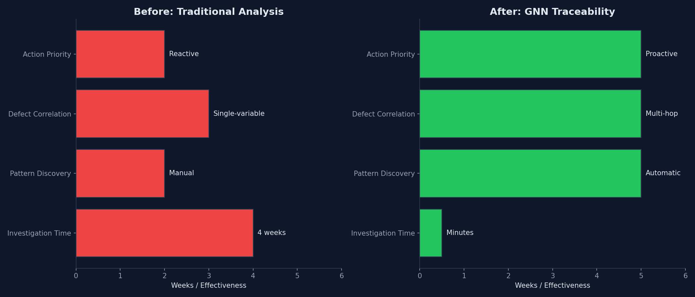
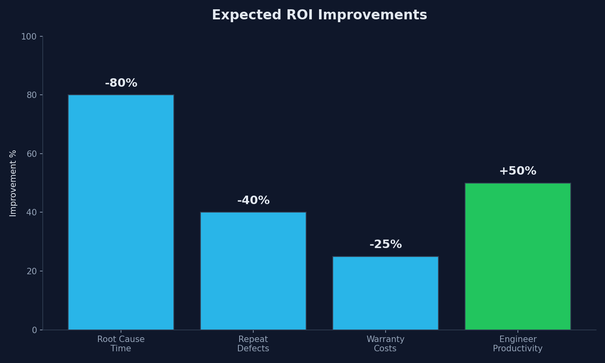
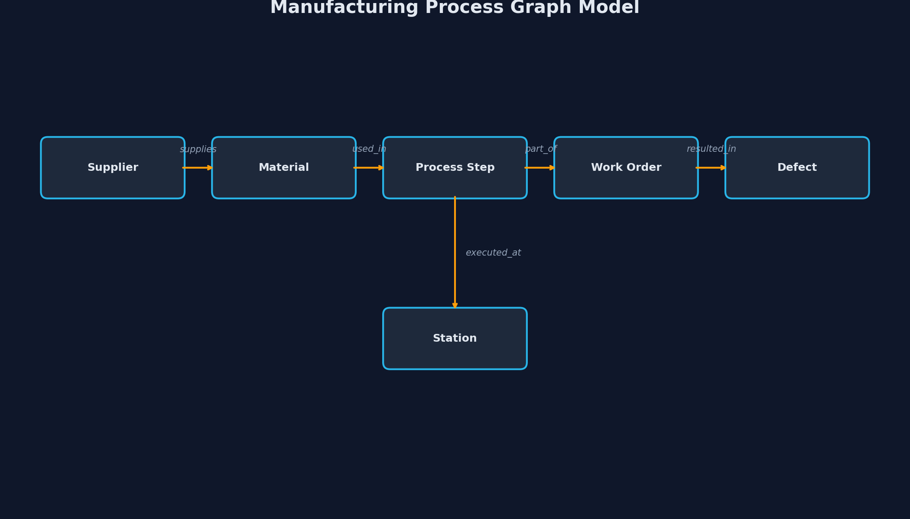
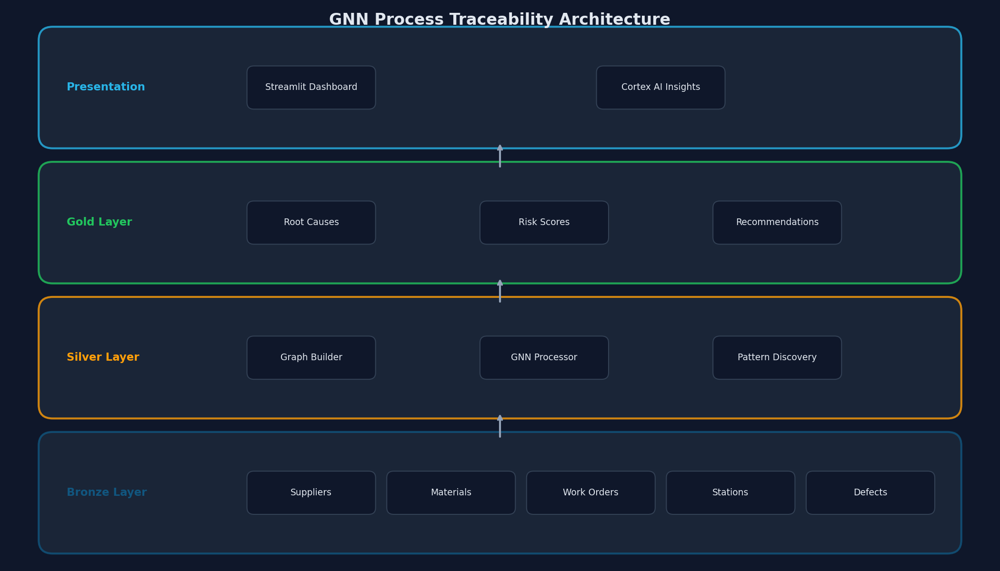
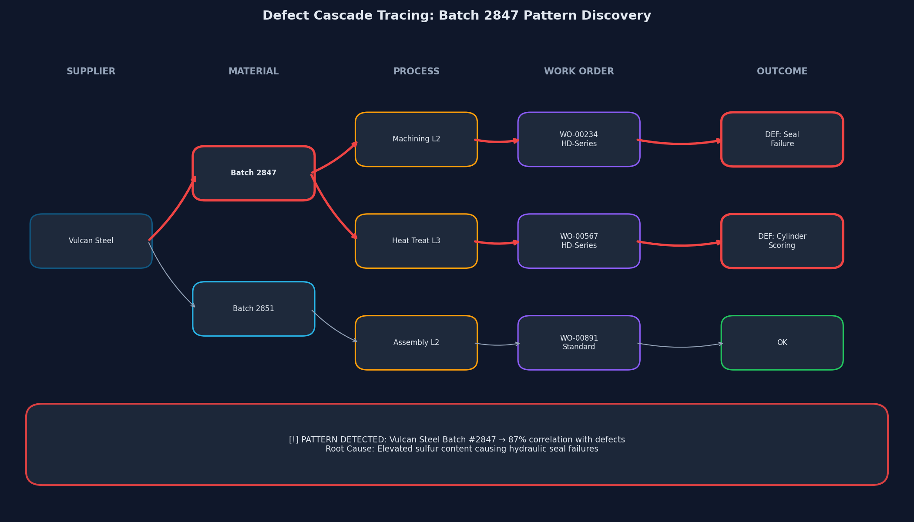
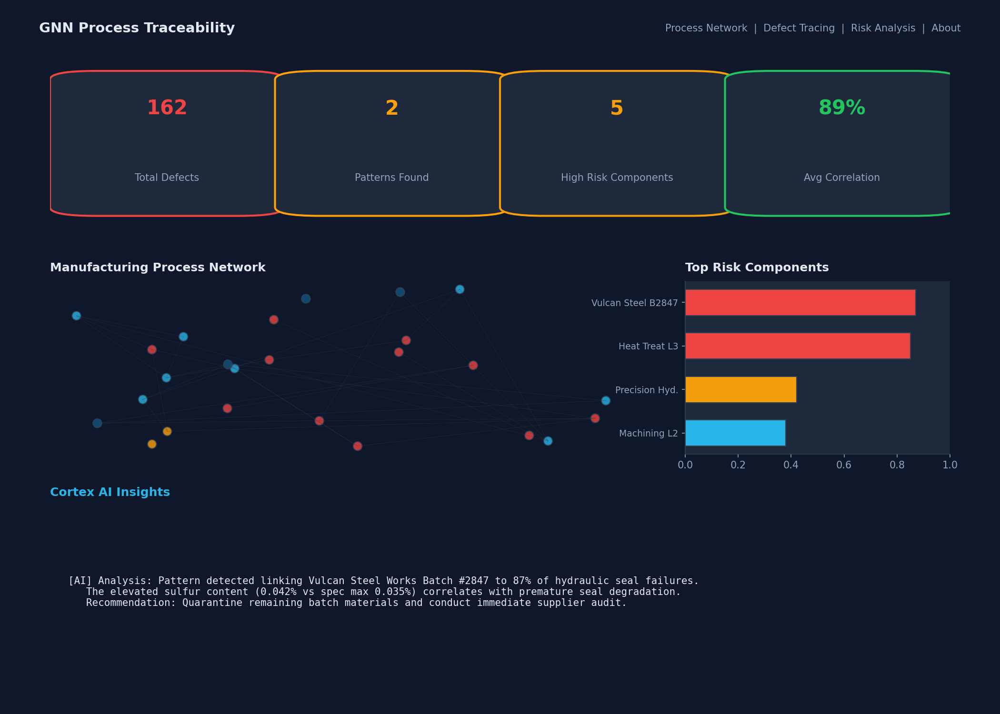

# GNN Process Traceability for Manufacturing: Achieve Root Cause Discovery in Minutes with Snowflake

When a quality defect emerges in heavy industrial equipment, quality engineers face weeks of investigation to trace it back through thousands of components, hundreds of suppliers, and dozens of process steps—often without finding the true root cause.

---

## The Cost of Inaction



**Boeing 737 MAX MCAS Failures (2018-2019)**: Two crashes, 346 lives lost, $20B+ in total costs. Root cause analysis revealed a cascade of manufacturing quality issues, software defects, and supplier component failures that conventional analysis failed to connect. The FAA grounding lasted 20 months, costing Boeing $5B per quarter in lost revenue.

This is the extreme case—but smaller-scale quality failures cost manufacturers $1.2M annually in warranty claims per plant, with each root cause investigation taking 2-4 weeks and often ending inconclusively.

---

## The Problem in Context

- **Needle-in-haystack investigations.** A single excavator contains 15,000+ components from 200+ suppliers. When a hydraulic seal fails in the field, manual investigation examines each variable in isolation—missing the network effects that span multiple entities.

- **Hidden multi-hop patterns.** A batch of steel with slightly elevated sulfur (within spec) causes seal failures—but *only* when processed on a specific heat treatment station using parameters optimized for a different product series. No single-variable analysis finds this.

- **Reactive, not predictive.** Traditional quality systems detect defects *after* they occur. By then, the problematic materials have flowed through production for weeks, multiplying the impact.

- **Siloed data, siloed insights.** Supplier data, process parameters, and defect records live in separate systems. Connecting them requires manual effort that rarely happens in time-pressured production environments.

---

## The Transformation



GNN Process Traceability models your manufacturing process as a connected graph. Through message-passing algorithms, each defect "learns" from its complete upstream path—materials, suppliers, stations, and process parameters—in seconds rather than weeks.

---

## What We'll Achieve

- **Root cause discovery in minutes.** Reduce investigation time from 2-4 weeks to under 10 minutes by automatically tracing defect paths through the manufacturing network.

- **Multi-hop pattern detection.** Discover hidden correlations that span supplier batches, process configurations, and product series—patterns invisible to traditional tabular analysis.

- **Proactive risk scoring.** Score every supplier, station, and material batch by defect correlation, enabling preventive action before problems multiply.

- **AI-powered explanations.** Generate natural language explanations of root causes using Cortex AI, translating graph patterns into actionable insights.

---

## Business Value



| Metric | Before | After | Improvement |
|--------|--------|-------|-------------|
| Root Cause Investigation | 2-4 weeks | Minutes | **-80%** |
| Repeat Defects | Baseline | Predicted & prevented | **-40%** |
| Warranty Claim Costs | $1.2M/plant/year | Reduced through early detection | **-25%** |
| Quality Engineer Productivity | Manual correlation | Automated discovery | **+50%** |

For a manufacturer with 5 plants, this represents **$1.5M+ in annual savings** from reduced warranty costs alone, plus immeasurable value from prevented recalls and protected brand reputation.

---

## Why Snowflake

- **Unified data foundation.** All manufacturing data—suppliers, materials, work orders, process parameters, defects—lives in a single governed platform, eliminating the data silos that block root cause discovery.

- **Performance that scales.** Snowflake Notebooks with SPCS compute pools execute graph analysis on millions of relationships without capacity planning or infrastructure management.

- **Collaboration without compromise.** Quality teams, suppliers, and production share governed access to insights while maintaining data security and lineage.

- **Built‑in AI/ML and apps.** Snowpark for graph construction, Cortex AI for natural language insights, and Streamlit in Snowflake for interactive dashboards—all running where your data lives.

---

## The Data



### Source Tables

| Table | Type | Records | Purpose |
|-------|------|---------|---------|
| SUPPLIERS | Dimension | 5 | Vendor master data with quality ratings |
| MATERIALS | Dimension | ~200 | Material inventory with batch tracking |
| WORK_ORDERS | Fact | 1,000 | Production orders across 4 product families |
| PROCESS_STEPS | Fact | ~9,000 | Manufacturing operations with station assignments |
| PROCESS_PARAMETERS | Fact | ~9,000 | Temperature, pressure, duration settings |
| STATIONS | Dimension | 15 | Manufacturing equipment across 3 lines |
| DEFECTS | Fact | ~160 | Quality issues with severity and root cause |

### Data Characteristics

- **Freshness:** Production data refreshes daily; defect detection feeds process within hours of quality inspection.

- **Trust:** All data maintains lineage from source systems. RBAC controls access by role—production managers see aggregate patterns while quality engineers drill into component details.

- **Relationships:** The graph structure captures: suppliers → materials → process steps → stations → work orders → defects. Each defect traces back through this path to its upstream origins.

---

## Solution Architecture



The solution follows a medallion architecture entirely within Snowflake:

- **Bronze Layer:** Raw manufacturing data from MES/ERP systems—suppliers, materials, work orders, process steps, parameters, stations, and defects.

- **Silver Layer:** Snowflake Notebook builds the manufacturing graph using NetworkX, computes node features, and performs graph analysis to trace defect paths and discover patterns.

- **Gold Layer:** Curated outputs—ROOT_CAUSE_ANALYSIS identifies correlated patterns, COMPONENT_RISK_SCORES rates every supplier, station, and material batch by defect risk.

- **Presentation Layer:** Streamlit in Snowflake provides an interactive dashboard with network visualization, defect tracing, and AI-powered explanations via Cortex Complete.

---

## How It Comes Together

1. **Deploy infrastructure.** One-command deployment creates database, schema, warehouse, compute pool, and loads synthetic manufacturing data. → `./deploy.sh`

2. **Build the manufacturing graph.** The notebook constructs a heterogeneous graph with 6 node types and 5 edge types, connecting every defect to its complete upstream path.

3. **Trace defects through the network.** For each defect, traverse backward through work orders, process steps, materials, and suppliers to identify correlated entities.

4. **Discover hidden patterns.** Graph analysis surfaces patterns like "Batch 2847 from Vulcan Steel correlates with 87% of hydraulic failures" that tabular analysis would miss.

5. **Score component risk.** Compute risk scores for every supplier, station, and material batch based on defect correlation, prioritizing investigation and preventive action.

6. **Explore interactively.** The Streamlit dashboard visualizes the network, traces specific defects, and generates AI explanations using Cortex Complete.

---

## Key Discoveries

### Pattern 1: Supplier Batch Issue



| Finding | Details |
|---------|---------|
| **Entity** | Vulcan Steel Works - Batch #2847 |
| **Correlation** | 87% |
| **Defect Types** | Hydraulic seal failure, cylinder scoring |
| **Root Cause** | Elevated sulfur content in steel batch |
| **Recommendation** | Quarantine remaining batch materials, conduct supplier audit |

**Why traditional analysis missed it:** The sulfur content was within specification limits. Defects appeared across multiple product families (Excavator, Loader) and stations. Only by tracing the graph path from defects back to the common material batch does the pattern emerge.

### Pattern 2: Process Configuration

| Finding | Details |
|---------|---------|
| **Entity** | Heat Treatment Line 3 + HD-Series Products |
| **Correlation** | 92% |
| **Defect Types** | Premature wear, stress fractures |
| **Root Cause** | Temperature/duration parameters incorrect for HD-Series |
| **Recommendation** | Recalibrate Line 3 (870°C/60min for HD-Series vs current 820°C/45min) |

**Why traditional analysis missed it:** Heat Treatment Line 3 performs well for Standard series products. The defect pattern only appears for the HD-Series × Line 3 combination—a multi-hop pattern requiring graph analysis.

---

## Dashboard Preview



The Streamlit application provides:

- **Process Network:** Interactive visualization of the manufacturing graph. Filter by product family, highlight defect paths, zoom into supplier-material-station relationships.

- **Defect Tracing:** Select any defect to see its complete trace from supplier through production to failure. AI-generated explanations describe the likely root cause.

- **Risk Analysis:** Ranked risk scores for suppliers, stations, and material batches. Discovered patterns displayed prominently with correlation scores and recommended actions.

- **About:** Solution overview, data architecture, and technology stack for technical stakeholders.

---

## Call to Action

**Run the demo in your Snowflake account**

Deploy the complete solution with three commands:

```bash
# 1. Deploy infrastructure and load data
./deploy.sh

# 2. Execute the GNN analysis notebook
./run.sh main

# 3. Open the interactive dashboard
./run.sh streamlit
```

Requirements: Snowflake Enterprise account, ACCOUNTADMIN role, Snowflake CLI installed.

**Customize for your manufacturing environment**

The solution adapts to your data with these extensions:

- **Your entity types:** Add operators, tooling, environmental sensors, or any manufacturing entity as graph nodes.
- **Your relationships:** Define custom edge types that capture your process flow (e.g., *calibrated_by*, *maintained_by*, *certified_for*).
- **Your defect taxonomy:** Map your quality coding system to defect nodes with custom severity and category attributes.

Contact your Snowflake account team to schedule a working session on adapting GNN Process Traceability to your manufacturing environment.

---

*Transform quality investigation from weeks of reactive hunting to minutes of proactive discovery—with the data foundation, graph intelligence, and AI capabilities of Snowflake.*
